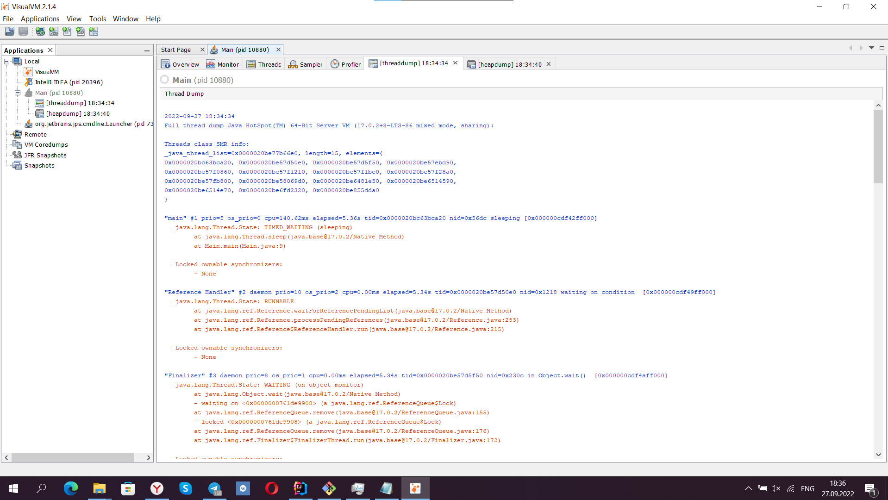
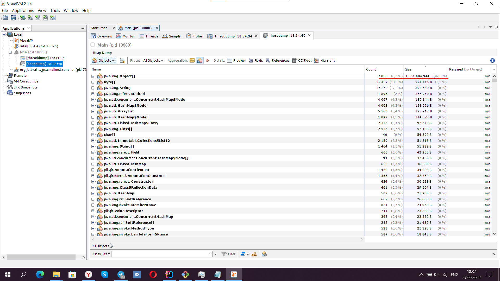

# Домашня работа 2

## Программа
Код программы находится в классе [Main](./src/main/java/Main.java) в методе main,
я просто бесконечно добавлял элементы в ArrayList, чтобы вызвать OutOfMemoryError

## Дампы
Я установил приложение VisualVM, для создание ThreadDump и HeapDump.
Я запустил программу, выбрал нужный процесс и создал нужные дампы 

## ThreadDump

Честно говоря, не очень понял для чего это в данной ситуации.

## HeapDump

На скриншоте видно, что используется вся доступная память

Все ресурсы я прикрепил в эту [папку](./resources)